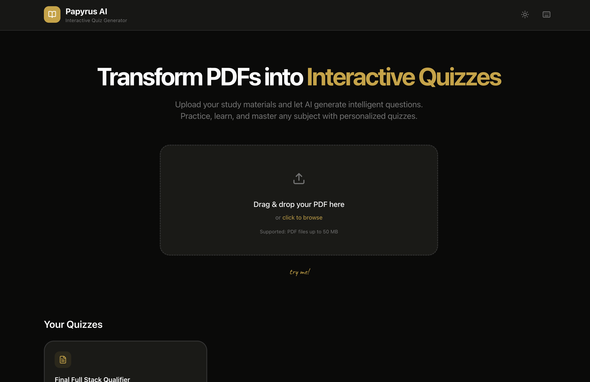

# Papyrus

Your textbooks are full of facts. Papyrus finds them and turns them into questions.

Upload any PDF. In seconds, you get a quiz with multiple choice, matching, and short answer questions. The app even handles charts and math formulas.




## Features

### Core Functionality
- **PDF Processing**: Upload PDFs and automatically extract text content
- **AI Question Generation**: Uses LLMs (OpenAI compatible APIs) to generate diverse question types
- **Vision Detection**: Detects pages that may need visual analysis (images, diagrams, charts)
- **Batch Processing**: Processes large PDFs in batches to handle documents of any size

### Question Types
- **Multiple Choice**: 4-option questions with single correct answer
- **Multi Select**: Multiple correct answers allowed
- **True/False**: Simple factual verification
- **Short Answer**: Brief text responses (1-2 sentences)
- **Fill in the Blank**: Key term and formula testing
- **Matching**: Pair relationships between concepts
- **Ordering**: Sequence and process arrangement

### Quiz Features
- **Full LaTeX Support**: Mathematical expressions render correctly throughout
- **Editable Questions**: Modify, add, or delete questions after generation
- **Difficulty Levels**: Questions tagged as easy, medium, or hard
- **Topic Organization**: Automatic topic extraction and categorization

### Quiz Taking Experience
- **Stopwatch Timer**: Track elapsed time during quizzes
- **Answer Persistence**: Close tab and return to continue where you left off
- **Question Navigator**: Jump to any question during the quiz
- **Progress Indicators**: Visual feedback on answered questions

### Results & Export
- **Comprehensive Results**: Score breakdown by question, topic, and points
- **Confetti Animation**: Celebrate achievements (70%+ scores)
- **JSON Export**: Export quizzes as structured JSON files
- **Anki/TSV Export**: Import directly into Anki flashcard app

### UI/UX
- **Dark & Light Mode**: Full theme support toggle
- **Drag & Drop Upload**: Intuitive file upload interface
- **Real-time Progress**: Comprehensive processing indicators showing:
  - Current page being processed
  - Processing stage (text extraction, vision detection, generation, validation)
  - Overall completion percentage

### LLM Configuration
- **API Key Rotation**: Round-robin multiple API keys for high-volume processing
- **Retry Logic**: 3 automatic retries with exponential backoff
- **Configurable**: All settings via environment variables
- **Compatible**: Works with OpenAI and OpenAI-compatible APIs

## Architecture

### Tech Stack
- **Framework**: Next.js 16 (App Router)
- **Language**: TypeScript
- **Styling**: Tailwind CSS v4 with custom design system
- **UI Components**: Custom components following design system
- **PDF Processing**: pdf-parse for text extraction
- **Icons**: Lucide React

### Project Structure
```
app/
├── globals.css          # Design system with dark/light themes
├── layout.tsx           # Root layout with theme provider
└── page.tsx             # Main application

components/
├── theme-provider.tsx   # Dark/light mode management
├── file-upload.tsx      # Drag & drop file upload
├── processing-indicator.tsx  # Real-time progress display
├── quiz-editor.tsx      # Full quiz editing interface
├── quiz-interface.tsx   # Quiz taking experience
└── quiz-results.tsx     # Results with confetti

lib/
├── llm-client.ts        # AI API client with retries & rotation
├── pdf-processor.ts     # PDF parsing and batch processing
└── storage.ts           # localStorage persistence & exports

types/
└── index.ts             # TypeScript type definitions
```

## Getting Started

### Prerequisites
- Node.js 18+
- npm or yarn
- OpenAI API key(s)

### Installation

1. Clone the repository:
```bash
git clone https://github.com/yourusername/papyrus-ai.git
cd papyrus-ai
```

2. Install dependencies:
```bash
npm install
```

3. Configure environment variables:
```bash
cp env.sample .env.local
```

Edit `.env.local` with your settings:
```env
# Comma-separated list of API keys for round-robin rotation
LLM_API_KEYS=sk-your-first-api-key,sk-your-second-api-key,sk-your-third-api-key

# API Base URL (OpenAI or compatible)
LLM_API_BASE_URL=https://api.openai.com/v1

# Model name
LLM_MODEL=gpt-4o-mini

# Processing settings
LLM_MAX_RETRIES=3
LLM_TIMEOUT=60000
PDF_BATCH_SIZE=5
```

4. Run the development server:
```bash
npm run dev
```

5. Open [http://localhost:3000](http://localhost:3000) in your browser

## Configuration

### Environment Variables

| Variable | Description | Default |
|----------|-------------|---------|
| `LLM_API_KEYS` | Comma-separated API keys | Required |
| `LLM_API_BASE_URL` | API endpoint URL | `https://api.openai.com/v1` |
| `LLM_MODEL` | Model to use | `gpt-4o-mini` |
| `LLM_MAX_RETRIES` | Retry attempts for failed calls | `3` |
| `LLM_TIMEOUT` | API timeout in ms | `60000` |
| `PDF_BATCH_SIZE` | Pages per batch processing | `5` |

### PDF Batch Size Recommendations

| Document Size | Recommended Batch Size |
|--------------|----------------------|
| Small (< 10 pages) | 3-5 |
| Medium (10-50 pages) | 5-10 |
| Large (50+ pages) | 10-15 |

Smaller batches = more API calls but better context
Larger batches = fewer API calls but may miss details

## Usage

### Creating a Quiz

1. **Upload PDF**: Drag and drop or click to select a PDF file
2. **Processing**: Monitor real-time progress as the AI:
   - Extracts text from pages
   - Analyzes content complexity
   - Generates questions in batches
   - Validates and deduplicates
3. **Edit**: Review and modify generated questions
4. **Save**: Store quiz for future use

### Taking a Quiz

1. Select a quiz from your library
2. Answer questions at your own pace
3. Navigate freely between questions
4. Submit when ready
5. Review detailed results

### Exporting

- **JSON**: Complete quiz data for backup or sharing
- **Anki TSV**: Direct import into Anki flashcards with:
  - Front: Question text
  - Back: Answer + explanation
  - Tags: Topic categories

## Design System

Papyrus follows a "terminal-at-night" aesthetic with:

### Colors
- **Background**: `#0a0a09` (dark) / `#fafaf9` (light)
- **Foreground**: `#fcfcfc` (dark) / `#1a1a1a` (light)
- **Accent**: `#cca133` (gold/amber)
- **Muted**: `#737373`
- **Borders**: `#333333` (dark) / `#d4d4d4` (light)

### Typography
- **Primary**: System UI font stack
- **Handwritten**: Caveat (for annotations)
- **Monospace**: ui-monospace (for code/timers)

### Components
- **Buttons**: Rounded-full with gold accent
- **Cards**: Rounded-xl with subtle borders
- **Glass panels**: Backdrop blur for overlays

## API Integration

The LLM client supports any OpenAI-compatible API:

```typescript
import { LLMClient } from '@/lib/llm-client';

const client = new LLMClient({
  apiKeys: ['sk-...'],
  baseUrl: 'https://api.openai.com/v1',
  model: 'gpt-4o-mini',
  maxRetries: 3,
  timeout: 60000,
  batchSize: 5,
});

const result = await client.generateQuestions(pages);
```

## Storage & Persistence

All data is stored locally in the browser:

- **Quizzes**: Indexed by ID with full metadata
- **Sessions**: Auto-saved progress during quiz taking
- **Exports**: File downloads for portability

No server-side storage required.

## Contributing

1. Fork the repository
2. Create a feature branch
3. Make your changes
4. Submit a pull request

## License

MIT License - see LICENSE file for details

## Acknowledgments

- Built with [Next.js](https://nextjs.org)
- Icons by [Lucide](https://lucide.dev)
- PDF parsing with [pdf-parse](https://www.npmjs.com/package/pdf-parse)
